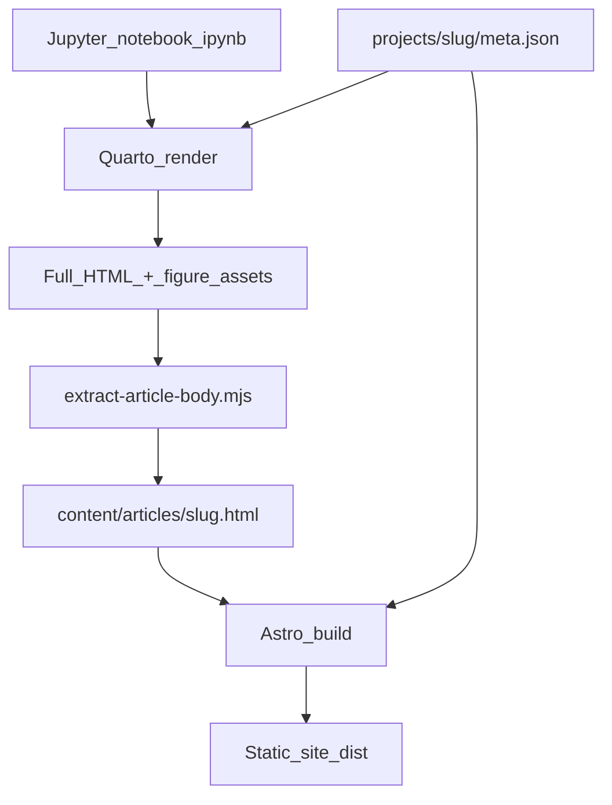

# Portfolio website architecture

## What you already have (source of truth)

| Asset | Role |
|-------|------|
| [`notebooks/kepler_second_law.ipynb`](../notebooks/kepler_second_law.ipynb) | **Authoring source** for Kepler II — markdown, code, plots (not duplicated for the web) |
| [`src/`](../src/) | Reusable simulation code imported by the notebook |
| [`tests/`](../tests/) | Numerical validation |

The notebook is **not** moved or overwritten. Each published project points at its notebook path in metadata.

---

## Recommended stack

| Layer | Tool | Why |
|-------|------|-----|
| Portfolio shell | **Astro** | Fast static site, simple pages (home, about, project index), shared layout/navigation, easy deploy (Vercel, Netlify, GitHub Pages) |
| Notebook → article | **Quarto** | First-class `.ipynb`, LaTeX math (KaTeX), code folding, executes cells at build time, HTML tuned for long-form science |
| Styling | **CSS + `@astrojs/tailwind` + Typography** | Dark, typography-led aesthetic without a generic template |
| Project registry | **JSON metadata** per project | One file drives cards, routes, and build targets |

**Why not JupyterLab embed?** It feels like a lab UI, not a publication. Readers should scroll an article, not operate a notebook server.

**Why not Next.js alone?** Next works, but Astro ships less JS for a mostly static portfolio and keeps project pages as pre-rendered HTML fragments.

**Why Quarto over raw nbconvert?** Quarto gives consistent math, figure captions, code-fold, and theming with less custom glue than nbconvert → MDX.

**Boundary:** Astro owns **chrome** (header, footer, project hero, SEO, project grid). Quarto owns **notebook body** (sections, equations, code, figures). A build script connects them.

---

## Repository layout

```text
computational-astrophysics/
├── notebooks/                    # Jupyter sources (unchanged location)
│   └── kepler_second_law.ipynb
├── projects/                     # One folder per portfolio project
│   ├── keplers-second-law/
│   │   └── meta.json             # title, slug, tags, notebook path, status
│   ├── orbital-mechanics/
│   │   └── meta.json             # placeholder (coming soon)
│   └── ...
├── src/                          # Python simulation library (shared)
├── website/                      # Astro portfolio
│   ├── src/
│   │   ├── layouts/
│   │   ├── components/
│   │   ├── pages/
│   │   ├── content/articles/     # Generated HTML bodies (gitignored or committed)
│   │   └── styles/
│   └── public/
├── quarto/                       # Shared Quarto format (theme, code-fold)
│   └── scientific-portfolio.yml
├── scripts/
│   ├── render-projects.mjs       # Quarto render all published projects
│   └── extract-article-body.mjs  # Strip Quarto HTML → embeddable fragment
└── docs/WEBSITE_ARCHITECTURE.md  # This file
```

---

## Build pipeline



1. **`npm run render:projects`** (from `website/` or root): for each `meta.json` with `"status": "published"`, run Quarto on the notebook path.
2. Quarto writes to `website/.quarto-output/<slug>/`.
3. **Extract script** copies figure assets to `website/public/projects/<slug>/` and saves the `<main>` inner HTML to `website/src/content/articles/<slug>.html`.
4. **`npm run build`**: Astro builds; `/projects/[slug]` wraps the fragment in `ProjectLayout` (hero + metadata from `meta.json`).

Local dev without re-executing Python: use `"status": "published"` and committed article HTML, or run render when you change the notebook.

---

## Adding a second project (checklist)

1. Create `projects/<slug>/meta.json` (copy from Kepler template).
2. Add your notebook under `notebooks/` or `projects/<slug>/`.
3. Set `"notebook": "relative/path.ipynb"` and `"status": "published"` when ready.
4. Run `npm run render:projects` then `npm run dev`.
5. Optional: add a placeholder card via `"status": "coming-soon"` in registry — no Quarto step.

No new Astro page per project: **`/projects/[slug]`** is dynamic.

---

## Tradeoffs

| Choice | Benefit | Cost |
|--------|---------|------|
| Quarto + HTML embed | Notebook stays source; math/code/plots preserved | Requires Quarto on machine/CI; two-tool mental model |
| Execute at build | Site always matches latest code | Build needs Python venv + deps |
| White matplotlib figures | Matches notebook today | Slight contrast on dark page — acceptable; optional dark `matplotlib` style for web builds later |
| Generated HTML in repo | Deploy without Quarto on CI | Larger git diffs when notebook outputs change |
| Astro not Quarto for whole site | Distinct portfolio brand, easy nav | Notebook pages need embed step, not native MDX |

---

## Deployment

- Build command: `npm run build:all` (render projects + Astro).
- Output: `website/dist/`.
- Set site URL in `website/astro.config.mjs` for canonical links when you deploy.

---

## Plot note (Kepler project)

Current figures use Matplotlib defaults (light background). They remain scientifically correct. For tighter dark-mode integration later, consider a shared `src/web_plot_style.py` applied only when building for the site — without changing underlying data.
